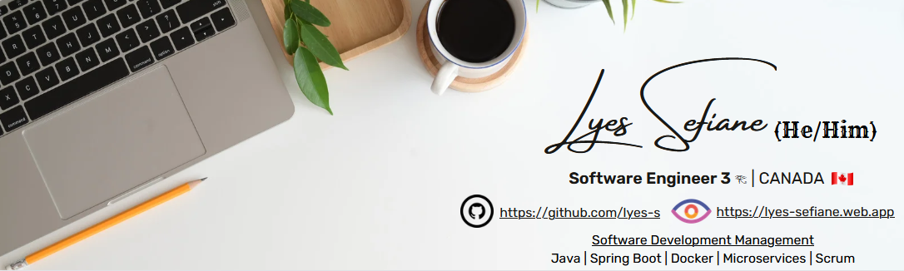

<!DOCTYPE html>
<html lang="en-US">
  <head>
    <meta charset="UTF-8">
    <meta http-equiv="X-UA-Compatible" content="IE=edge">
    <meta name="keywords" content="Lyes SEFIANE - Canada | GitHub" />
    <meta name="viewport" content="width=device-width, initial-scale=1">
    <meta name="description" content="Mr. Lyes SEFIANE, born on August 30th, 1988 in Tizi-Ouzou, Algeria, is an Algerian-Canadian dual citizen, Native Amazigh (Indigenous peoples of North Africa), Native Kabyle (an Amazigh ethnic group indigenous to the mountainous Kabylia region of Northern Algeria), Software Engineer 3 residing in Ottawa, the Canada's capital city. He received multiple positive recognitions, referred to as "Ciena Bravos", from his colleagues at Ciena for his Customer First, Innovation, Velocity and Outstanding People.
Graduated from the Université Mouloud Mammeri de Tizi-Ouzou (Algeria) with a Bachelor's degree, Computer Science (Fairly Good - Honors) in 2010 after successfully earning a Baccalaureate Diploma, Natural and Life Sciences (Fairly Good - Honors) from Lalla Fatma N'Soumer Secondary Education School of Tizi-Ouzou in 2007.
On August 2010 I was accepted into the Université Paris 8 Vincenne-Saint-Denis, a french higher foreign educational institution via "Campus France Algérie" to pursuit my studies where I earned a Postgraduate Diploma, Computer Science (Fairly Good - Honors) in 2011 and my first Master's degree, Computer Science & Human Sciences (Fairly Good - Honors) in 2012.
After successfully completing my research internships at Laboratoire IBISC, Université d’Evry, Université Paris-Saclay in the context of my first Master's degree, I was accepted by the prestigious Grande École and Université Paris Dauphine-PSL where I earned in 2014 my second Master's degree, Computers and Intelligent Systems (Fairly Good - Honors) jointly awarded with Grande École AgroParisTech, following the completion of an engineering & research internship at EDF R&D.
After more than a year as President of IT-DMSIC Corporation (Dismissed permanently on 2016-06-22), I immigrated to Canada as skilled worker (Certificat de Sélection du Québec (CSQ) issued on 2015-11-17) where I signed the confirmation of my Permanent Residency in Montréal-Pierre Elliott Trudeau International Airport on October 2016.
As Algerian, Native Amazigh, Native Kabyle and Permanent Resident of Canada, I worked at Ciena Corporation (a U.S. optical networking and software company based in Hanover, Maryland) for more than 05 years as full time employee to engineering official Ciena Corporation's desktop software products named NAVA and NAVA Collector Agent available for the Windows platforms as Software Engineer 3 and Product Owner, written with Java 11, JavaFx/OpenJFX and Spring Core dedicated to the Optical Telecommunication domain to aid the Ciena Corporation's telecommunications engineers on their daily tasks. The NAVA project came to an end on December 2021, successfully completed and fully delivered (including digital signature).">
    <meta name="author" content="Lyes SEFIANE">
    <meta name="google-site-verification" content="6lf9VPhWhHflMu4S3V96g-GIsTE7pbSRQVnYnGxvBeY" />
    <link rel="canonical" href="https://github.com/lyes-sefiane/lyes-sefiane" title="Lyes SEFIANE - Canada | GitHub">    
    <link href="css/main.css" rel="stylesheet"></link>
  </head>

  <body>
  

      
    
  

  ## About Me
Mr. Lyes SEFIANE, born on August 30th, 1988 in <a href="https://maps.app.goo.gl/kSXZ65gdiTkuaKwR6" target="_blank">Tizi-Ouzou, Algeria</a>, is an <a href="https://drive.google.com/file/d/1HzOTDT4hrelHlvfMTe-rifpWcx39zinb/view?usp=sharing" target="_blank">Algerian</a>-<a href="https://drive.google.com/file/d/12dh_p6dAjBZSimROL9dcw-bLXMYd6yrV/view?usp=drive_link" target="_blank">Canadian</a> dual citizen, Native <a href="https://dpul.princeton.edu/oral-history-nes/feature/who-are-the-amazigh" target="_blank">Amazigh</a> (Indigenous peoples of North Africa), Native <a href="https://en.wikipedia.org/wiki/Kabyle_people" target="_blank">Kabyle</a> (an Amazigh ethnic group indigenous to the mountainous Kabylia region of Northern Algeria), <a href="https://hiring.monster.com/resources/job-descriptions/computer/senior-software-engineer/" target="_blank">Software Engineer 3</a> residing in <a href="https://maps.app.goo.gl/DyicXDprhspQdiKXA">Ottawa</a>, the Canada's capital city. He received multiple positive recognitions,
referred to as "<a href="https://www.ciena.com/about/purpose" target="_blank">Ciena Bravos</a>", from his colleagues at Ciena for his <a href="https://lyes-sefiane.web.app/#honors-awards" target="_blank">Customer First, Innovation, Velocity and Outstanding People</a>.

Graduated from the <a href="https://www.ummto.dz/" target="_blank">Université Mouloud Mammeri de Tizi-Ouzou</a> (Algeria) with a Bachelor's degree, Computer Science</a> (Fairly Good - Honors) in 2010 after successfully earning a Baccalaureate Diploma, Natural and Life Sciences (Fairly Good - Honors) from <a href="https://share.google/w3pdgX5q91evTyXPJ" target="_blank">Lalla Fatma N'Soumer Secondary Education School of Tizi-Ouzou</a> in 2007.

 

On August 2010 I was accepted into the <a href="https://www.univ-paris8.fr/" target="_blank">Université Paris 8 Vincenne-Saint-Denis</a>, a french higher foreign educational institution via "<a href="https://www.algerie.campusfrance.org/" target="_blank">Campus France Algérie</a>" to pursuit my studies where I earned a Postgraduate Diploma, Computer Science (Fairly Good - Honors) in 2011 and my first Master's degree, Computer Science & Human Sciences (Fairly Good - Honors) in 2012.

After successfully completing my research internships at <a href="https://www.ibisc.univ-evry.fr/" target="_blank">Laboratoire IBISC, Université d’Evry, Université Paris-Saclay</a> in the context of my first Master's degree, I was accepted by the prestigious <a href="https://dauphine.psl.eu/en/" target="_blank">Grande École and Université Paris Dauphine-PSL</a> where I earned in 2014 my second Master's degree, Computers and Intelligent Systems (Fairly Good - Honors) jointly awarded with <a href="https://www.agroparistech.fr/en" target="_blank">Grande École AgroParisTech</a>, following the completion of an engineering & research internship at <a href="https://www.edf.fr/en" target="_blank">EDF R&D</a>.

After more than a year as President of IT-DMSIC Corporation (<a href="https://www.verif.com/en/company/IT-DMSIC-68d9c0471299230338c1fe55/" target="_blank">Dismissed permanently on 2016-06-22</a>), I immigrated to Canada as skilled worker (<a href="https://www.canada.ca/en/immigration-refugees-citizenship/services/immigrate-canada/quebec-skilled-workers/apply/guide-q7000-application-permanent-residence-quebec-skilled-worker-class.html" target="_blank">Certificat de Sélection du Québec</a> (CSQ) issued on 2015-11-17) where I signed the <a href="https://www.canada.ca/en/immigration-refugees-citizenship/services/immigrate-canada/pr-confirmation-portal.html" target="_blank">confirmation of my Permanent Residency</a> in <a href="https://en.wikipedia.org/wiki/Montr%C3%A9al%E2%80%93Trudeau_International_Airport" target="_blank">Montréal-Pierre Elliott Trudeau International Airport</a> on October 2016.

As <a href="https://drive.google.com/file/d/1ZFE8EHSwM2NZnp4pd2QSYdXrZNnNiiO_/view" target="_blank">Algerian</a>, Native <a href="https://dpul.princeton.edu/oral-history-nes/feature/who-are-the-amazigh" target="_blank">Amazigh</a>, Native <a href="https://en.wikipedia.org/wiki/Kabyle_people" target="_blank">Kabyle</a> and <a href="https://www.canada.ca/en/immigration-refugees-citizenship/services/permanent-residents/status.html" target="_blank">Permanent Resident of Canada</a>, I worked at <a href="https://en.wikipedia.org/wiki/Ciena">Ciena Corporation</a> (a U.S. optical networking and software company based in Hanover, Maryland) for more than 05 years as full time employee to engineering official <a href="https://en.wikipedia.org/wiki/Ciena">Ciena Corporation</a>'s desktop software products named <strong>NAVA</strong> and <strong>NAVA Collector Agent</strong> available for the <a href="https://www.microsoft.com/en-us/windows" target="_blank">Windows platforms</a> as <a href="https://hiring.monster.com/resources/job-descriptions/computer/senior-software-engineer/" target="_blank">Software Engineer 3</a> and <a href="https://www.scrum.org/resources/what-is-a-product-owner" target="_blank">Product Owner</a>, written with <strong>Java 11</strong>, <strong>JavaFx/OpenJFX</strong> and <strong>Spring Core</strong> dedicated to the <a href="https://www.sciencedirect.com/topics/engineering/optical-telecommunication" target="_blank">Optical Telecommunication</a> domain to aid the <a href="https://en.wikipedia.org/wiki/Ciena">Ciena Corporation</a>'s telecommunications engineers on their daily tasks. The NAVA project came to an end on December 2021, successfully completed and fully delivered (including digital signature).

## Profile
  <ul>
    <li>8+ year's experience developing software using Java ecosystem.</li>
    <li>3 year's experience leading the software development team using Agile Scrum methodology.</li>
    <li>Experience building and designing RESTful Web Services with Spring Framework 6+, JUnit, Redis, PostgreSQL, MongoDB, Docker, Postman, Openapi/Swagger, Apache Kafka.</li>
    <li>Experience in use of standard SCM tools (Git) and build automation tools (Maven).</li>
    <li>Experience working with remote teams in different time zones (Canada, USA, UK, India).</li>
    <li>Hands-on DevOps practices (automation and continuous delivery) using GitHub Actions, Snyk, SonarQube, DockerHub, Firebase.</li>
  </ul>  

  ## 🏆 Github Profile Trophy
  
  
  
  ## GitHub Stats / Top Languages
  
  

    
    
  

  ## 🛠 Technology Stack

  
  
  
  
  
  
  
  
  
  
  
  
  
  
  
  
  
  
  
  
  
  
  
  
  
  
  
  
  
  
  
  
  

  ## Views

  

  ## Contact

  <table>
    <tr>
      <td>
          
      </td>    
      <td>
          
      </td>
    </tr>
  </table> 

  ## License

  This repository is licensed under the [Creative Commons Attribution-NonCommercial-NoDerivs 4.0 International License][cc-by-nc-nd].

  [![CC BY-NC-ND 4.0][cc-by-nc-nd-image]][cc-by-nc-nd]

  [cc-by-nc-nd]: http://creativecommons.org/licenses/by-nc-nd/4.0/
  [cc-by-nc-nd-image]: https://licensebuttons.net/l/by-nc-nd/4.0/88x31.png
  [cc-by-nc-nd-shield]: https://img.shields.io/badge/License-CC%20BY--NC--ND%204.0-lightgrey.svg

    
  </body>
</htm>
