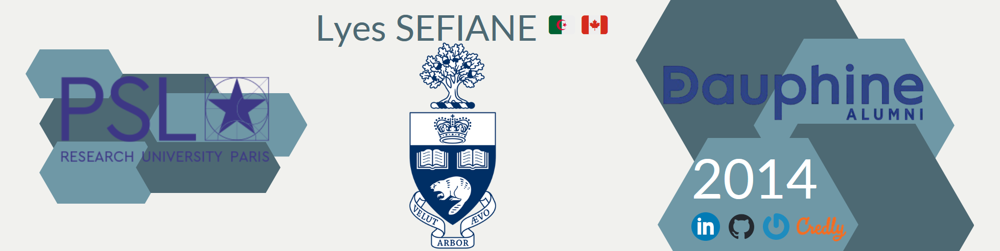

<!DOCTYPE html>
<html lang="en-US">
  <head>
    <meta charset="UTF-8">
    <meta http-equiv="X-UA-Compatible" content="IE=edge">
    <meta name="keywords" content="Lyes SEFIANE - Canada | GitHub" />
    <meta name="viewport" content="width=device-width, initial-scale=1">
    <meta name="description" content="Software Engineering Manager. Of Algerian Nationality and Canadian Citizenship, Graduated from Two Separate Higher Education Institutions in France : Grande École and Université Paris Dauphine-PSL ( Dauphine Campus and AgroParisTech ) in 2014 and Université Paris 8 Vincennes Saint-Denis in 2012 with 02 Master's degree in Computer Science ( Cum Laude honor ) after being Graduated from Université Mouloud Mammeri de Tizi-Ouzou ( Algeria ) in 2010 with a Bachelor of Computer Science - BCompSc ( Cum Laude honor ). 8+ years experience developing software using the Java ecosystem technologies such as Java 8+, Spring Framework 5+, JUnit, PostgreSQL, Redis, MongoDB, Docker, Postman, Openapi/Swagger, to develop Desktop, RESTful Webservices, and Microservices by applying Agile Scrum methodology.">
    <meta name="author" content="Lyes SEFIANE">
    <meta name="url" content="Lyes SEFIANE">
    <title>Lyes SEFIANE - Canada | GitHub</title>
    <link rel="canonical" href="https://github.com/lyes-sefiane/lyes-sefiane">    
    <link href="css/main.css" rel="stylesheet"></link>
  </head>

  <body>
  

      
    
  

  ## About Me
  
Of <a href="https://drive.google.com/file/d/1HzOTDT4hrelHlvfMTe-rifpWcx39zinb/view?usp=sharing" target="_blank">Algerian Nationality</a> and <a href="https://drive.google.com/file/d/12dh_p6dAjBZSimROL9dcw-bLXMYd6yrV/view?usp=drive_link" target="_blank">Canadian Citizenship</a>, Graduated from Two Separate Higher Education Institutions in France : Grande École et <a href="https://www.dauphine-alumni.org/fr/cv/lyes-sefiane/dauphine/2014" target="_blank">Université Paris Dauphine-PSL</a> ( Dauphine Compus & AgroParisTech ) in 2014 and <a href="https://www.univ-paris8.fr/" target="_blank">Université Paris 8 Vincennes Saint-Denis</a> in 2012 with 02 Master's degree in Computer Science ( Cum Laude honor ) after being Graduated from <a href="https://www.ummto.dz/" target="_blank">Université Mouloud Mammeri de Tizi-Ouzou</a> ( Algeria ) in 2010 with a Bachelor of Computer Science - BCompSc ( Cum Laude honor ). 
  
<strong>8+ years experience</strong> developing software using the Java ecosystem technologies such as           
  <a href="https://drive.google.com/file/d/1piHjMizqSBvIhxeB9qCPgHAnV3hJtzTM/view?usp=sharing" target="_blank">Java 8+</a>, 
  <a href="https://drive.google.com/file/d/1_hCAitNjtv90Bv1HnrzX3qJGLjMw2M3q/view?usp=sharing" target="_blank">Spring Framework 6+</a>, 
  <a href="https://drive.google.com/file/d/1MAOtte0IFEo5OpzQBQpcGsfksjkNntFV/view?usp=sharing" target="_blank">JUnit</a>, 
  PostgreSQL, 
  <a href="https://drive.google.com/file/d/1E-6fBJNDFexQmiOR23RTjCLeqwoIelsk/view?usp=sharing" target="_blank">Redis</a>, 
  <a href="https://drive.google.com/file/d/13LHbMemnlSewWXcoGg-t8J4cE_L35Run/view?usp=sharing" target="_blank">MongoDB</a>, 
  <a href="https://drive.google.com/file/d/1LKHVj3ZWSXwjdFTVRpPPvKt5920d-3s6/view?usp=sharing" target="_blank">Docker</a>, 
  <a href="https://app.swaggerhub.com/organizations/lyes-sefiane" target="_blank">Openapi/Swagger</a>, 
  to develop
  <a href="https://whatfix.com/blog/desktop-application/" target="_blank">Desktop</a>,
  <a href="https://drive.google.com/file/d/17bJ2TJOIoKYa8ns4kWrjwqM6nv_Spp_1/view?usp=sharing" target="_blank">RESTful Webservices</a>, 
  and <a href="https://microservices.io/">Microservices</a> by applying <a href="https://drive.google.com/file/d/1kZ9n1LEIaIUBzZyyza2tMoxcmlS147_A/view?usp=sharing" target="_blank">Agile Scrum methodology</a>.     
    
  Please refer to my <a href="https://ca.linkedin.com/in/lyes-sefiane" target="_blank">LinkedIn</a> and <a href="https://github.com/lyes-sefiane" target="_blank">GitHub</a> profiles for more information.

 

  ## 🏆 Github Profile Trophy

  

  ## GitHub Stats / Top Languages

  

    
    
  

  ## 🛠 Technology Stack

  
  
  
  
  
  
  
  
  
  
  
  
  
  
  
  
  
  
  
  
  
  
  
  
  
  
  
  
  
  
  
  
  

  ## Views

  

  ## Contact

  <table>
    <tr>
      <td>
          
      </td>    
      <td>
          
      </td>
    </tr>
  </table> 

  ## License

  This repository is licensed under the [Creative Commons Attribution-NonCommercial-NoDerivs 4.0 International License][cc-by-nc-nd].

  [![CC BY-NC-ND 4.0][cc-by-nc-nd-image]][cc-by-nc-nd]

  [cc-by-nc-nd]: http://creativecommons.org/licenses/by-nc-nd/4.0/
  [cc-by-nc-nd-image]: https://licensebuttons.net/l/by-nc-nd/4.0/88x31.png
  [cc-by-nc-nd-shield]: https://img.shields.io/badge/License-CC%20BY--NC--ND%204.0-lightgrey.svg

    
  </body>
</htm>